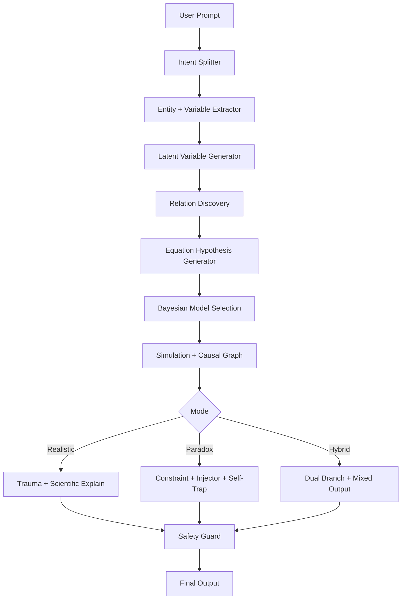

# Bayes + Senaryo Fiziği + Paradoks + Denklem Keşfi Mimarisi (Yeni / Bağımsız Tasarım)

> Bu doküman, mevcut eski `.md` içeriklerinden **bağımsız**, sadece bu isteğe özel olarak hazırlanmış yeni bir mimari tanımıdır.

## 1) Amaç ve Kapsam

Bu sistemin hedefi klasik "problem → çöz" yaklaşımını aşarak şu yetenekleri aynı çekirdekte birleştirmektir:

1. **Fiziksel olarak tutarlı olasılıksal senaryo üretimi** (Bayes + Monte Carlo)
2. **Mantıksal/paradoksal çıktı üretimi** (self-trapping reasoning)
3. **Denklem keşfi** (Equation Discovery) ile değişken/ilişki/denklem kurma
4. **Açıklama katmanı** ile bilimsel, anlatısal veya hibrit çıktı

---

## 2) Mevcut Mimariye Göre Eksik Modüller (Gap Map)

Aşağıdaki modüller mevcut deterministik solver mimarisinde tipik olarak eksiktir ve yeni sistem için zorunludur:

### A. Senaryo ve Dünya Simülasyonu Eksikleri
- Prompt Intent Splitter
- World Model Builder
- Bayesian Prior Layer
- Stochastic Scenario Generator
- Causal Graph Engine
- Trauma Estimation Model

### B. Denklem Keşfi Eksikleri
- Variable & Entity Extractor
- Latent Variable Generator
- Relation Discovery Engine
- Equation Discovery Engine (Symbolic + Physics Priors)
- Multi-Hypothesis Generator
- Bayesian Model Selection
- Equation Validation Loop

### C. Paradoks / Meta-Akıl Eksikleri
- Constraint Builder
- Paradox Injector
- Self-Trap Loop
- Meta-Contradiction Controller

### D. Çıktı ve Güvenlik Eksikleri
- Explanation Mode Selector
- Uncertainty Reporter
- Safety & Content Policy Guard

---

## 3) Katmanlı Hiyerarşi (Önerilen)

```text
L0  Input Layer
    └─ Prompt Normalizer

L1  Intent & Task Decomposition
    ├─ Prompt Intent Splitter
    └─ Task Graph Builder

L2  Semantic Modeling
    ├─ Variable & Entity Extractor
    ├─ Latent Variable Generator
    └─ Assumption Registry

L3  World + Equation Model
    ├─ World Model Builder
    ├─ Relation Discovery Engine
    ├─ Equation Discovery Engine
    └─ Multi-Hypothesis Generator

L4  Inference & Simulation
    ├─ Bayesian Inference Core
    ├─ Bayesian Prior Layer
    ├─ Monte Carlo Simulation
    ├─ Causal Graph Engine
    └─ Equation Validation Loop

L5  Specialized Modes
    ├─ Realistic Mode Pipeline
    ├─ Paradox Mode Pipeline
    └─ Hybrid Mode Pipeline

L6  Risk/Impact Estimation
    ├─ Trauma Estimation Model (domain-specific scoring)
    └─ Uncertainty + Confidence Scoring

L7  Narrative & Explanation
    ├─ Explanation Mode Selector
    ├─ Scientific Report Generator
    ├─ Dramatic Narrative Generator
    └─ Paradox Narrative Generator

L8  Safety & Governance
    ├─ Policy Guard
    ├─ Output Sanitizer
    └─ Trace & Audit Logger
```

---

## 4) Mod Bazlı Akışlar

### 4.1 Realistic Mode (Fiziksel Tutarlılık)

```text
Prompt
→ Intent Splitter (REALISTIC)
→ World Model Builder
→ Bayesian Priors
→ Monte Carlo Sampling
→ Causal Graph Propagation
→ Impact/Trauma Estimation
→ Confidence + Uncertainty Report
→ Scientific Explanation
```

**Özellik:** Kural ihlali yok; fizik öncülleri korunur; sonuçlar dağılım olarak raporlanır.

---

### 4.2 Paradox Mode (Self-Trapping Reasoning)

```text
Prompt
→ Intent Splitter (PARADOX)
→ Constraint Builder (A→B, B→C)
→ Paradox Injector (C→¬A vb.)
→ Self-Trap Loop
→ Meta-Contradiction Deepener
→ Paradox Narrative Output
```

**Özellik:** Bilinçli çelişki üretir; mantıksal kapan oluşturarak metni derinleştirir.

---

### 4.3 Hybrid Mode (Kısmi Kural İhlali)

```text
Prompt
→ Intent Splitter (HYBRID)
→ World Model
→ Equation Discovery + Bayesian Selection
→ Partial Rule Break Layer
→ Dual Simulation (realistic + paradox branch)
→ Mixed Explanation Output
```

**Özellik:** Hem olasılıksal tutarlılık hem de yaratıcı çatışma birlikte sunulur.

---

## 5) Core Modül Spesifikasyonları

## 5.1 Prompt Intent Splitter
**Input:** ham kullanıcı metni  
**Output:** `{mode, confidence, sub_tasks[]}`

Örnek etiketler:
- `SOLVE`
- `SIMULATION_REALISTIC`
- `PARADOX_NARRATIVE`
- `HYBRID_SIM_PARADOX`
- `EQUATION_DISCOVERY`

---

## 5.2 Variable & Entity Extractor
**Görev:** Varlıklar, olaylar, parametreler, birimler, kısıtlar çıkarılır.

```json
{
  "entities": ["uçak", "insan", "patlama"],
  "variables": ["m", "v", "r", "E", "P"],
  "constraints": ["r > 0", "m > 0"]
}
```

---

## 5.3 Latent Variable Generator
**Görev:** Eksik değişkenler için prior üretmek.

Örnek:
- `E ~ LogUniform(1e5, 1e8)`
- `r ~ Uniform(1, 50)`
- `orientation ~ Categorical(front, side, back)`

---

## 5.4 Relation Discovery Engine
**Görev:** Nedensel ve fonksiyonel ilişkileri çıkarır.

Örnek adaylar:
- `pressure ∝ E / r^2`
- `injury_score = f(pressure, impulse, shielding)`
- `survival_prob = sigmoid(-injury_total)`

---

## 5.5 Equation Discovery Engine (EDE)

Üç kanallı aday üretim:
1. **Symbolic Regression**
2. **Physics Prior Templates**
3. **Randomized Formula Mutation**

Sonra:
- Aday denklemleri normalize et
- Boyutsal tutarlılık kontrolü
- Bayesian skorla sıralama

---

## 5.6 Bayesian Inference Core

Temel görevler:
- Posterior güncellemesi
- Eksik parametre imputation
- Belirsizlik propagasyonu

Skorlama:
- `P(H | D) ∝ P(D | H) P(H)`

---

## 5.7 Causal Graph Engine

DAG tabanlı olay zinciri:

```text
impact → rupture → explosion → shockwave → tissue_damage
```

Her edge:
- etki büyüklüğü
- gecikme
- olasılık dağılımı

---

## 5.8 Trauma Estimation Model

Not: Bu katman **zarar üretme rehberi değil**, sadece simülasyon/analizsel skor katmanıdır.

Örnek çıktı:
```json
{
  "head": {"score": 0.82, "ci95": [0.70, 0.91]},
  "arm": {"score": 0.41, "ci95": [0.20, 0.65]},
  "leg": {"score": 0.56, "ci95": [0.32, 0.74]},
  "internal": {"score": 0.77, "ci95": [0.61, 0.88]}
}
```

---

## 5.9 Paradox Generator + Self-Trap Loop

Constraint set:
- `A → B`
- `B → C`

Enjeksiyon:
- `C → ¬A`

Loop davranışı:
1. Çelişki tespit et
2. Açıklamayı genişlet
3. Çatışmayı derinleştir
4. Yeni alt-çelişki üret

---

## 5.10 Explanation Mode Selector

Seçenekler:
- **Scientific**: formül + posterior + güven aralığı
- **Narrative**: dramatik ama nedensel tutarlı metin
- **Paradox**: bilinçli çelişki + meta-yorum
- **Hybrid**: tablo + anlatı + paradoks katmanı

---

## 6) Birleştirilmiş Veri Sözleşmesi (Interface Contract)

```json
{
  "intent": {"mode": "HYBRID_SIM_PARADOX", "confidence": 0.91},
  "entities": [],
  "variables": [],
  "priors": {},
  "hypotheses": [],
  "selected_model": {},
  "simulation": {
    "samples": 10000,
    "outputs": {},
    "uncertainty": {}
  },
  "causal_graph": {},
  "paradox": {
    "enabled": true,
    "contradictions": []
  },
  "explanation": {
    "mode": "mixed",
    "text": ""
  },
  "safety": {
    "policy_flags": [],
    "sanitized": true
  }
}
```

---

## 7) Operasyonel Akış (Orkestrasyon)



---

## 8) MVP (Minimum Viable Product) Yol Haritası

### Faz-1 (çekirdek)
- Intent Splitter
- Entity/Variable Extractor
- Priors + Monte Carlo
- Basic Causal Graph
- Basic Explanation Engine

### Faz-2 (denklem keşfi)
- Relation Discovery
- Symbolic Regression tabanı
- Multi-hypothesis + Bayesian selection
- Validation Loop

### Faz-3 (paradoks)
- Constraint Builder
- Paradox Injector
- Self-Trap Loop
- Paradox Narrative Renderer

### Faz-4 (sertleştirme)
- Safety guard
- Audit log
- Prompt robustness
- Performance tuning

---

## 9) Başarı Kriterleri (KPIs)

1. **Physical Consistency Rate** (realistic mod)
2. **Posterior Calibration Error**
3. **Equation Recovery Score** (sentetik testlerde)
4. **Paradox Coherence Score**
5. **Narrative Quality + Explainability Score**
6. **Latency / Throughput**

---

## 10) Özet

Bu yeni mimari ile sistem:
- sadece çözüm vermez, **değişken ve denklem de keşfeder**,
- belirsizliği Bayes ile yönetir,
- nedensel grafik üstünde simülasyon yapar,
- istenirse kontrollü paradoks üretir,
- bilimsel + anlatısal hibrit çıktılar oluşturur.

Böylece sistem, klasik deterministik solver’dan **world-modeling + equation-discovery + meta-reasoning** seviyesine yükselir.
