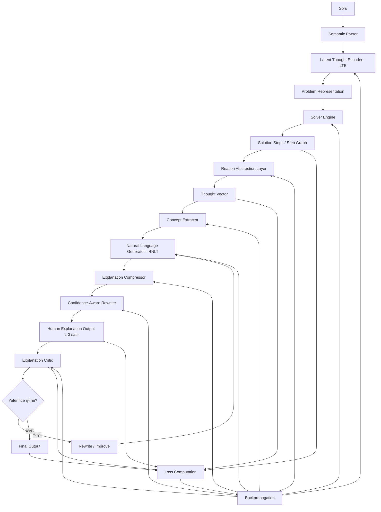
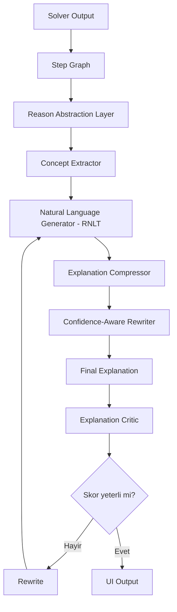

# Thinking Loop + Backprop ile Tamamlanmış Mimari

Bu doküman, mevcut "çözüyor ama anlatamıyor" durumunu **anlayan ve anlatan katman** ile giderir.
Odak, sadece doğru cevabı üretmek değil; çözüm izini insan-dostu açıklamaya dönüştürmek, eleştirip iyileştirmek ve tüm hattı geri yayılımla öğrenilebilir hale getirmektir.

## 1) Uçtan uca ana mimari (Thinking + Explanation + Learning)



---

## 2) “Anlayan ve Anlatan Katman” nasıl eklenir?

Mevcut yapıda `Solver Engine -> Solution Steps` zaten var. Eksik olan bölüm, bu çözüm izini insan diliyle açıklayan ara katmandır.

### Eklenmesi gereken zincir

```text
[Solution Steps / Step Graph]
        ↓
[Reason Abstraction Layer]
        ↓
[Concept Extractor]
        ↓
[Natural Language Generator (RNLT)]
        ↓
[Explanation Compressor]
        ↓
[Confidence-Aware Rewriter]
        ↓
[Human Explanation (2-3 satır)]
```

### Neden bu zincir gerekli?

- Eski akış: `Solution -> Debug Metrics -> UI`
- Doğru akış: `Solution -> Meaning Extraction -> Human Explanation`

Yani model iç sinyallerini (vektör, and-chain, debug trace) direkt kullanıcıya vermek yerine önce **anlam çıkarımı**, sonra **doğal dil üretimi** yapılır.

---

## 3) Her adımda mevcut yapıda nasıl çalışır? (adım adım entegrasyon)

### Adım 1 — Solver çıktısını `Step Graph` olarak standartlaştır
- Girdi: `Solver Engine` ara adımları.
- Çıktı: düğüm/kenar yapısında düzenli çözüm izi (`Step Graph`).
- Amaç: açıklama katmanlarının aynı formatı tüketmesi.

### Adım 2 — `Reason Abstraction Layer` ekle
- Girdi: `Step Graph` + kritik ara değerler.
- İş: teknik adımları insan seviyesine indirgeme.
- Örnek dönüşüm:

```json
{
  "v_x": 7.07,
  "v_y": 7.07,
  "h_max": 2.55
}
```

→

```text
"Hız yatay ve dikey bileşenlere ayrıldı, ardından dikey hız ile maksimum yükseklik hesaplandı."
```

### Adım 3 — `Concept Extractor` ekle (`questions_db.json` bağlantılı)
- Girdi: soru kategorisi (`cat`) + Step Graph özetleri.
- Veri kaynağı: `questions_db.json`.
- Çıktı: konsept listesi (ör. `parabolik hareket`, `yerçekimi`, `hız bileşenleri`).
- Amaç: anlatımın konuya bağlı ve pedagojik olması.

### Adım 4 — `Natural Language Generator (RNLT)` ekle
- Girdi: soyutlanmış akıl yürütme + konseptler + sonuç.
- Çıktı: doğal dilde kısa açıklama taslağı.
- Kural: hard-coded if/else şablonlardan kaçın; öğrenen seq2seq/transformer decoder kullan.

### Adım 5 — `Explanation Compressor` ekle
- Girdi: RNLT taslak açıklaması.
- Çıktı: 2–3 satıra sıkıştırılmış, gereksiz detaydan arındırılmış metin.
- Amaç: kullanıcı arayüzünde okunabilirlik.

### Adım 6 — `Confidence-Aware Rewriter` ekle
- Girdi: açıklama + güven skoru + critic sinyali.
- Davranış:
  - düşük güven: temkinli dil ("yaklaşık", "bu varsayımla"),
  - yüksek güven: net dil ("hesaplandı", "sonuç şudur").

### Adım 7 — `Explanation Critic` ile öz-yansıtma döngüsü
- Kritik kontroller:
  - adımlara sadakat (faithfulness),
  - açıklık,
  - tutarlılık,
  - sayı spam / iç model ifşası.
- Skor düşükse `Rewrite/Improve` tetiklenir ve yeniden yazım döngüsü çalışır.

### Adım 8 — Çok amaçlı loss ile geri yayılım
- Sadece final cevaba değil, açıklama kalitesine de gradient akıt.
- Öneri:
  - `L_total = λ1*L_answer + λ2*L_explanation + λ3*L_faithfulness + λ4*L_critic`
- Backprop hedefleri: `LTE`, `Solver`, `Reason Layer`, `RNLT`, `Compressor`, `Rewriter`, `Critic`.

---

## 4) Açıklama odaklı alt mimari (detay akış)



---

## 5) Çıktı kalite kuralları (zorunlu)

### Kaldırılması gereken hatalı çıktı türleri
- `NLP-Vektör[...] | Mantık:AND_CHAIN` gibi debug metinleri.
- Kullanıcıya model iç temsili sızdıran ham teknik izler.
- Açıklama içinde numeric spam (anlamsız sayısal yığın).

### Hedef çıktı formatı
- 2–3 satır,
- konu kavramlarını içeren,
- adımla uyumlu,
- insan dilinde kısa açıklama.

Örnek:

```text
Açıklama:
Başlangıç hızı yatay ve dikey bileşenlere ayrıldı.
Dikey bileşenle maksimum yükseklik, toplam uçuş süresiyle menzil hesaplandı.
```

---

## 6) Minimum modül arayüzleri (implementasyona hazır)

```text
z_thought = LTE(x, context)
problem_repr = BuildProblemRepr(z_thought, parsed)
steps = Solver(problem_repr)
reason_units = ReasonAbstraction(steps)
concepts = ConceptExtractor(reason_units, question_meta, questions_db)
draft_exp = RNLT(reason_units, concepts, answer)
short_exp = ExplanationCompressor(draft_exp, max_lines=3)
final_exp = ConfidenceAwareRewriter(short_exp, confidence, critic_hint)
critic_score = ExplanationCritic(final_exp, steps, answer)
L_total = MultiObjectiveLoss(answer, final_exp, critic_score, supervision)
Backprop(L_total)
```

---

## 7) Sonuç

Bu entegrasyonla sistem:
- **hesaplar** (solver),
- **anlar** (reason abstraction + concept extraction),
- **anlatır** (RNLT + compressor + rewriter),
- **kendini düzeltir** (critic loop),
- **öğrenir** (multi-loss + backprop).

Kısacası mimari, "hesap makinesi + debug output" seviyesinden çıkıp, insan merkezli açıklama üreten öğrenilebilir bir reasoning sistemine dönüşür.
